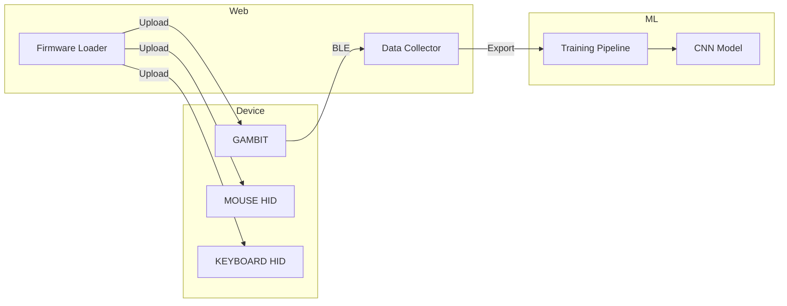

# SIMCAP

*Sensor Inferred MOtion CAPture*

---

<link rel="stylesheet" href="src/simcap.css">

## Architecture



## Components

### ML Pipeline

#### [ML Training Pipeline](ml/)
**Gesture Classification from IMU Data**

Python pipeline for training gesture classifiers: data loading, preprocessing, 1D CNN models, and TFLite deployment.

`Status: Active`

---

### Device Firmware

#### [GAMBIT](src/device/GAMBIT/)
**Gyroscope Accelerometer Magnetometer Baseline Inference Telemetry**

Espruino Puck.js firmware for 9-DoF IMU data collection at 50Hz with BLE streaming.

`Status: Active`

#### [MOUSE](src/device/MOUSE/)
**BLE HID Mouse**

Tilt-to-cursor mouse firmware. Pairs as Bluetooth HID mouse with any device.

`Status: Active`

#### [KEYBOARD](src/device/KEYBOARD/)
**BLE HID Keyboard**

Gesture-based keyboard with macro, arrow key, and media control modes.

`Status: Active`

#### [BAE](src/device/BAE/)
**Bluetooth Advertise Everything**

Reference implementation for BLE advertising with EspruinoHub/MQTT integration.

`Status: Reference`

---

### Web Interfaces

#### [Firmware Loader](src/web/loader/)
**Upload Firmware via WebBLE**

Web-based tool to upload GAMBIT, MOUSE, KEYBOARD, or custom firmware to Puck.js devices.

`Status: Active`

#### [GAMBIT Web](src/web/GAMBIT/)
**Baseline Data Collection UI**

Web UI for real-time sensor visualization and GitHub data upload via WebBLE.

`Status: Active`

#### [GAMBIT Collector](src/web/GAMBIT/collector.html)
**Labeled Data Collection for ML Training**

Enhanced UI with gesture labeling, session metadata, and export for training pipeline.

`Status: Active`

#### [P0](src/web/P0/)
**Initial Prototype**

WebSocket-based data visualization and capture interface with D3.js charts.

`Status: Prototype`

---

### Documentation

#### [Documentation Index](docs/)
**Implementation & Design Docs**

Component documentation and system architecture overview.

`Status: Documentation`

#### [Design Documents](docs/design/)
**Conceptual Analysis & Research**

Vision vs. reality analysis, roadmap, and ML pipeline proposals.

`Status: Design`

---

### Concepts & Research

#### [JOYPAD](src/web/JOYPAD/)
**Dual-Hand Game Controller Concept**

Emulating controller HID from sensor data using two SIMCAP devices.

`Status: Concept`

#### [FFO$$](src/web/FFO$$/)
**Fist Full Of Dollars**

$1 family algorithms for gesture inference from low-dimensional observation.

`Status: Research`

---

## Quick Start

### Upload Firmware
1. Open [Firmware Loader](https://christopherdebeer.github.io/simcap/src/web/loader/)
2. Click "Connect" and select your Puck.js
3. Choose firmware (GAMBIT, MOUSE, or KEYBOARD)
4. Click "Upload Selected" then "Save to Flash"

### Data Collection
1. Open [Collector UI](https://christopherdebeer.github.io/simcap/src/web/GAMBIT/collector.html)
2. Connect device and configure session metadata
3. Select gesture, record, and export labeled data

### ML Training
```bash
pip install -r ml/requirements.txt
python -m ml.train --data-dir data/GAMBIT --epochs 50
```

## Data

Baseline sensor data is stored in [`data/GAMBIT/`](data/GAMBIT/) with optional `.meta.json` label files.

## Links

- [GitHub Repository](https://github.com/christopherdebeer/simcap)
- [Firmware Loader](https://christopherdebeer.github.io/simcap/src/web/loader/)
- [Data Collector](https://christopherdebeer.github.io/simcap/src/web/GAMBIT/collector.html)
- [Espruino Puck.js](https://www.puck-js.com/)
