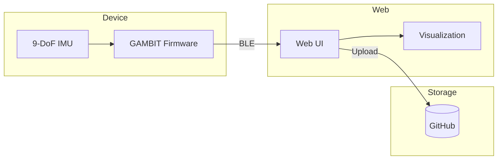

# SIMCAP

*Sensor Inferred MOtion CAPture*

---

<link rel="stylesheet" href="src/simcap.css">

## Architecture

## Components

### Device Firmware

#### [GAMBIT Device](src/device/GAMBIT/)
**Gyroscope Accelerometer Magnetometer Baseline Inference Telemetry**

Espruino Puck.js firmware for 9-DoF IMU data collection at 50Hz with BLE streaming.

`Status: Active`

#### [BAE](src/device/BAE/)
**Bluetooth Advertise Everything**

Reference implementation for BLE advertising with EspruinoHub/MQTT integration.

`Status: Reference`

---

### Web Interfaces

#### [GAMBIT Web](src/web/GAMBIT/)
**Baseline Data Collection UI**

Web UI for real-time sensor visualization and GitHub data upload via WebBLE.

`Status: Active`

#### [P0](src/web/P0/)
**Initial Prototype**

WebSocket-based data visualization and capture interface with D3.js charts.

`Status: Prototype`

---

### Documentation

#### [Documentation Index](docs/)
**Implementation & Design Docs**

Component documentation and system architecture overview.

`Status: Documentation`

#### [Design Documents](docs/design/)
**Conceptual Analysis & Research**

Vision vs. reality analysis, roadmap, and ML pipeline proposals.

`Status: Design`

---

### Concepts & Research

#### [JOYPAD](src/web/JOYPAD/)
**Dual-Hand Game Controller Concept**

Emulating controller HID from sensor data using two SIMCAP devices.

`Status: Concept`

#### [FFO$$](src/web/FFO$$/)
**Fist Full Of Dollars**

$1 family algorithms for gesture inference from low-dimensional observation.

`Status: Research`

---

## Quick Start

1. Flash [GAMBIT firmware](src/device/GAMBIT/) to Puck.js
2. Tap phone to device (NFC) or open [Web UI](https://christopherdebeer.github.io/simcap/src/web/GAMBIT/)
3. Press "Connect" and select device
4. Press "Get data" to start capture

## Data

Baseline sensor data is stored in [`data/GAMBIT/`](data/GAMBIT/) (40+ JSON files from Nov 2023 - Jan 2024).

## Links

- [GitHub Repository](https://github.com/christopherdebeer/simcap)
- [Hosted Web UI](https://christopherdebeer.github.io/simcap/src/web/GAMBIT/)
- [Espruino Puck.js](https://www.puck-js.com/)
