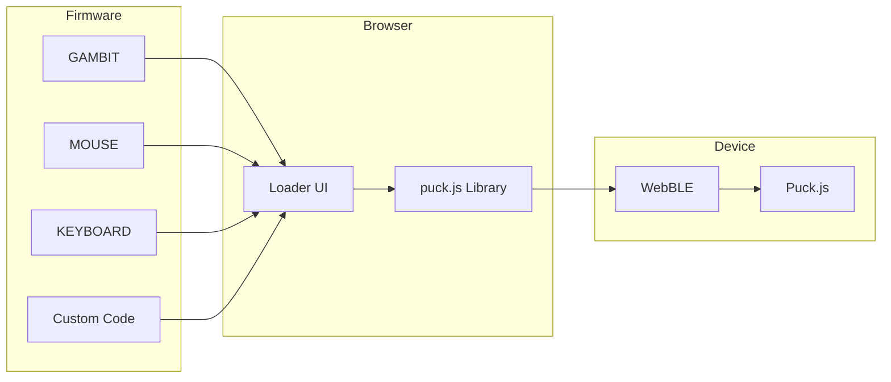
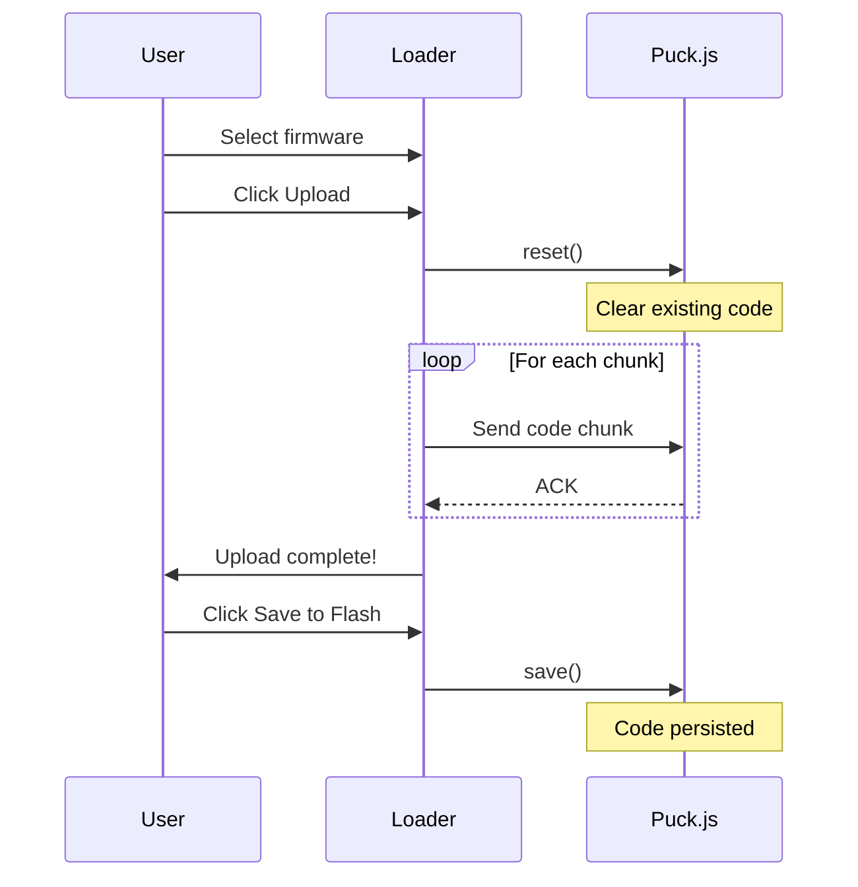

# SIMCAP Firmware Loader

**Web-based firmware upload tool for Espruino Puck.js devices**

Upload SIMCAP firmware or custom code to Puck.js devices via WebBLE, similar to the Espruino Web IDE but focused on SIMCAP firmware.

## Features



## Usage

### Online
Open: https://simcap.parc.land/src/web/loader/

### Local
```bash
cd /path/to/simcap
python -m http.server 8000
# Open http://localhost:8000/src/web/loader/
```

## Interface

### Preset Firmware Tab

Select and upload pre-built SIMCAP firmware:

| Firmware | Description |
|----------|-------------|
| **GAMBIT** | 9-DoF IMU telemetry for ML data collection |
| **MOUSE** | BLE HID Mouse - tilt to move cursor |
| **KEYBOARD** | BLE HID Keyboard - macros & gestures |
| **BAE** | Bluetooth Advertise Everything (reference) |

### Custom Code Tab

Upload any Espruino JavaScript:

1. Paste code into editor
2. Click "Upload Code"
3. Click "Save to Flash" to persist

### Console Tab

Interactive device console:
- View device output
- Send commands manually
- Debug uploaded code

## Upload Process



## Requirements

- **Browser:** Chrome 70+, Edge, Opera (NOT Safari, NOT Brave)
- **Platform:** Windows 10+, macOS, Android, ChromeOS, Linux
- **Device:** Espruino Puck.js v2 (or compatible)

### iOS
WebBLE requires the [WebBLE app](https://itunes.apple.com/us/app/webble/id1193531073) on iOS.

### Linux
Enable "Experimental Web Platform Features" in chrome://flags

## Troubleshooting

### Connection Fails
1. Ensure Bluetooth is enabled
2. Try pressing Puck.js button before connecting
3. Check browser supports WebBLE

### Upload Fails Mid-Way
1. Reconnect to device
2. Try uploading again (streaming resumes)
3. If persistent, use "Reset Device" first

### Windows 11 Issues
Some Windows 11 systems have Bluetooth MTU issues. If uploads fail repeatedly:
1. Check for Bluetooth driver updates
2. Try using Chrome instead of Edge
3. Use smaller code chunks (contact for modified loader)

## Technical Details

- **Protocol:** BLE Nordic UART Service
- **Chunk Size:** 500 bytes
- **Upload Method:** Streaming execution (code runs as received)
- **Persistence:** Requires `save()` to store in flash

## Related

- [GAMBIT Firmware](../../device/GAMBIT/)
- [MOUSE Firmware](../../device/MOUSE/)
- [KEYBOARD Firmware](../../device/KEYBOARD/)
- [Espruino Web IDE](https://www.espruino.com/Web+IDE)

---

[← Back to SIMCAP](../../../)

---

<link rel="stylesheet" href="../../simcap.css">
