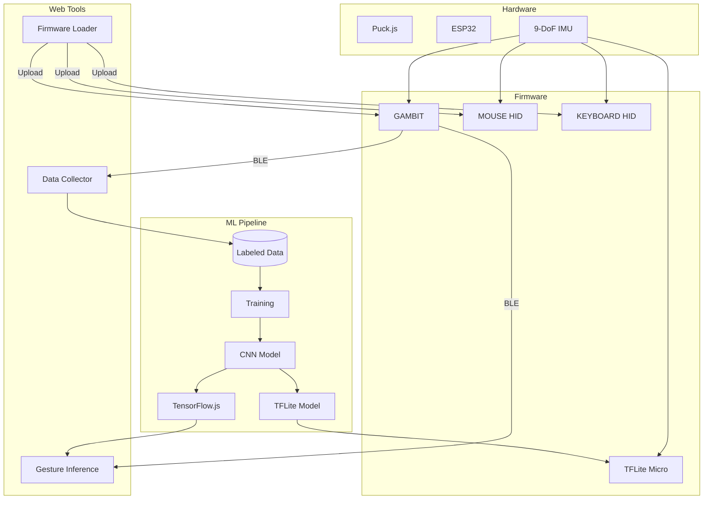

# SIMCAP Documentation

📖 **[View Complete Documentation Index](./INDEX.md)** - Searchable catalog of all 60+ documentation files

## Guides

| Guide | Description |
|-------|-------------|
| [Inference Deployment Guide](inference-deployment-guide.md) | Deploying models to browser, ESP32, and Puck.js |
| [Calibration & Filtering Guide](calibration-filtering-guide.md) | Magnetometer calibration and signal filtering |
| [Future Enhancements](gambit-future-enhancements-imp.md) | Planned improvements and roadmap |

## Implementation Documentation

For documentation on what's actually implemented, see the README files in each component:

### ML Pipeline

| Component | Status | Description |
|-----------|--------|-------------|
| [ML Pipeline](../ml/) | Active | Gesture classification training pipeline |
| [ML Documentation](./ml/) | Active | Machine learning pipeline and physics-based models |
| [Clustering Guide](./ml/clustering-analysis.md) | Active | Unsupervised clustering for gesture discovery |

### Device Firmware

| Component | Status | Description |
|-----------|--------|-------------|
| [GAMBIT](../src/device/GAMBIT/) | Active | 9-DoF IMU telemetry firmware for Puck.js |
| [ESP32](../src/device/ESP32/) | Template | TFLite Micro gesture inference for ESP32 |
| [MOUSE](../src/device/MOUSE/) | Active | BLE HID Mouse - tilt to move cursor |
| [KEYBOARD](../src/device/KEYBOARD/) | Active | BLE HID Keyboard - macros & gestures |
| [BAE](../src/device/BAE/) | Reference | BLE advertising reference implementation |
| [P0](../src/device/P0/) | Prototype | WebSocket-based serial interface |

### Web Interfaces

| Component | Status | Description |
|-----------|--------|-------------|
| [Firmware Loader](../src/web/loader/) | Active | Upload firmware to Puck.js via WebBLE |
| [GAMBIT Web](../src/web/GAMBIT/) | Active | Real-time sensor visualization and gesture inference |
| [GAMBIT Collector](../src/web/GAMBIT/collector.html) | Active | Labeled data collection for ML training |
| [GAMBIT Synth](../src/web/GAMBIT/synth.html) | Active | Sensor-reactive audio synthesizer |
| [P0 Web](../src/web/P0/) | Prototype | D3.js visualization interface |
| [JOYPAD](../src/web/JOYPAD/) | Concept | Dual-hand game controller concept |
| [FFO$$](../src/web/FFO$$/) | Research | $1 gesture algorithm research direction |

### Data

| Location | Description |
|----------|-------------|
| [data/GAMBIT/](../data/GAMBIT/) | Baseline sensor data (24 JSON files, Nov 2023 - Jan 2024) |
| [📊 Visualization Explorer](../visualizations/index.html) | Interactive web interface to explore sensor data visualizations |

### Visualizations

| Component | Status | Description |
|-----------|--------|-------------|
| [Visualization Pipeline](../ml/visualize.py) | Active | Generates composite images, window images, and index.html |
| [Explorer Generator](../ml/generate_explorer.py) | Active | Generates unified explorer.html with clustering integration |
| [📊 Session Explorer](../visualizations/index.html) | Active | Basic web-based visualization browser |
| [🎯 Unified Explorer](../visualizations/explorer.html) | Active | Advanced explorer with clustering, labeling workflow |

---

## Design Documents

For speculative designs, proposals, and conceptual analysis, see:

### [Design & Research](design/)

Contains future vision documents and research directions:

- **[Revisiting SIMCAP](design/revisiting-simcap.md)** - Comprehensive analysis of theoretical vision vs. current implementation, including three-tier roadmap and ML architecture proposals
- **[GAMBIT Workflow Review](design/gambit-workflow-review.md)** - Analysis of the GAMBIT data collection and training workflow
- **[Magnetic Finger Tracking Analysis](design/magnetic-finger-tracking-analysis.md)** - Research on using magnetometer for finger position tracking

---

## System Architecture

## Component Status Legend

| Status | Meaning |
|--------|---------|
| **Active** | Production-ready, actively maintained |
| **Template** | Working template, needs customization |
| **Prototype** | Functional but not production-ready |
| **Reference** | Working example, not actively developed |
| **Concept** | Design document only, not implemented |
| **Research** | Exploratory research direction |

---

[← Back to SIMCAP](../)

---

<link rel="stylesheet" href="../src/simcap.css">
