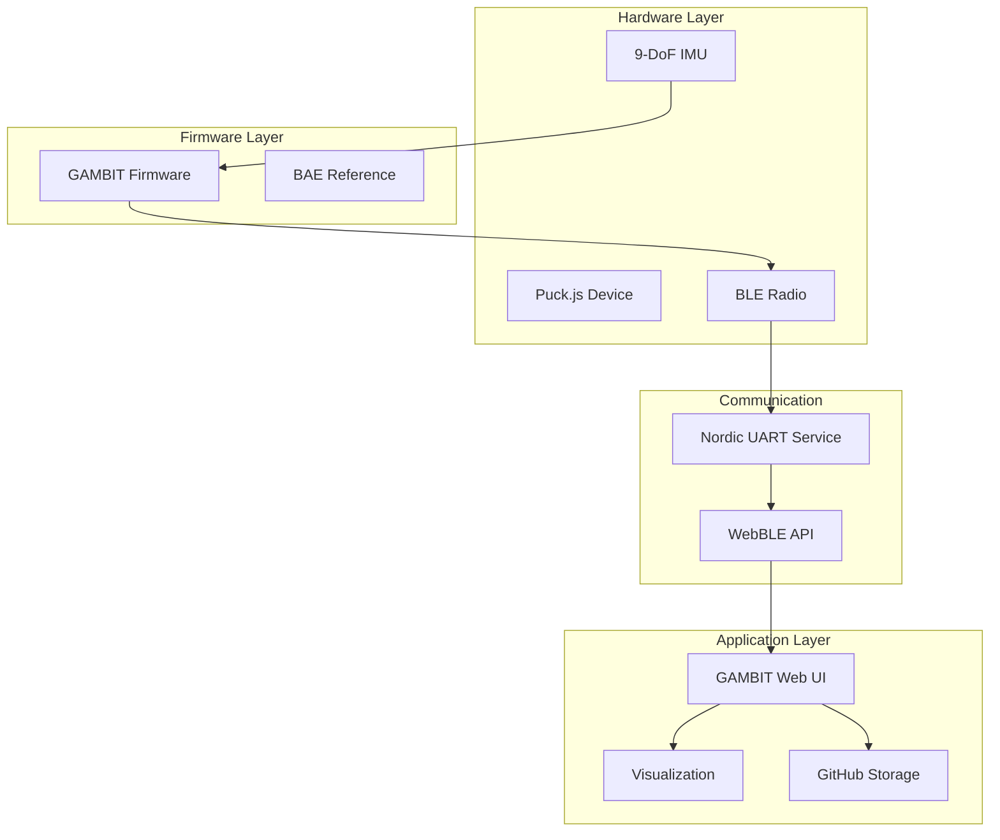

# SIMCAP Documentation

## Implementation Documentation

For documentation on what's actually implemented, see the README files in each component:

### Device Firmware

| Component | Status | Description |
|-----------|--------|-------------|
| [GAMBIT](../src/device/GAMBIT/) | Active | 9-DoF IMU telemetry firmware for Puck.js |
| [BAE](../src/device/BAE/) | Reference | BLE advertising reference implementation |
| [P0](../src/device/P0/) | Prototype | WebSocket-based serial interface |

### Web Interfaces

| Component | Status | Description |
|-----------|--------|-------------|
| [GAMBIT Web](../src/web/GAMBIT/) | Active | Real-time sensor visualization and data collection |
| [P0 Web](../src/web/P0/) | Prototype | D3.js visualization interface |
| [JOYPAD](../src/web/JOYPAD/) | Concept | Dual-hand game controller concept |
| [FFO$$](../src/web/FFO$$/) | Research | $1 gesture algorithm research direction |

### Data

| Location | Description |
|----------|-------------|
| [data/GAMBIT/](../data/GAMBIT/) | Baseline sensor data (40+ JSON files, Nov 2023 - Jan 2024) |

---

## Design Documents

For speculative designs, proposals, and conceptual analysis, see:

### [Design & Research](design/)

Contains future vision documents and research directions:

- **[Revisiting SIMCAP](design/revisiting-simcap.md)** - Comprehensive analysis of theoretical vision vs. current implementation, including three-tier roadmap and ML architecture proposals

---

## System Architecture

## Component Status Legend

| Status | Meaning |
|--------|---------|
| **Active** | Production-ready, actively maintained |
| **Prototype** | Functional but not production-ready |
| **Reference** | Working example, not actively developed |
| **Concept** | Design document only, not implemented |
| **Research** | Exploratory research direction |

---

[← Back to SIMCAP](../)
