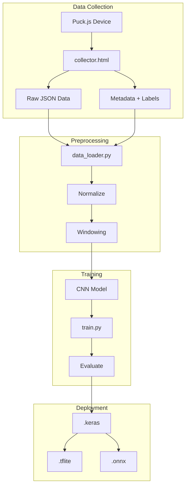
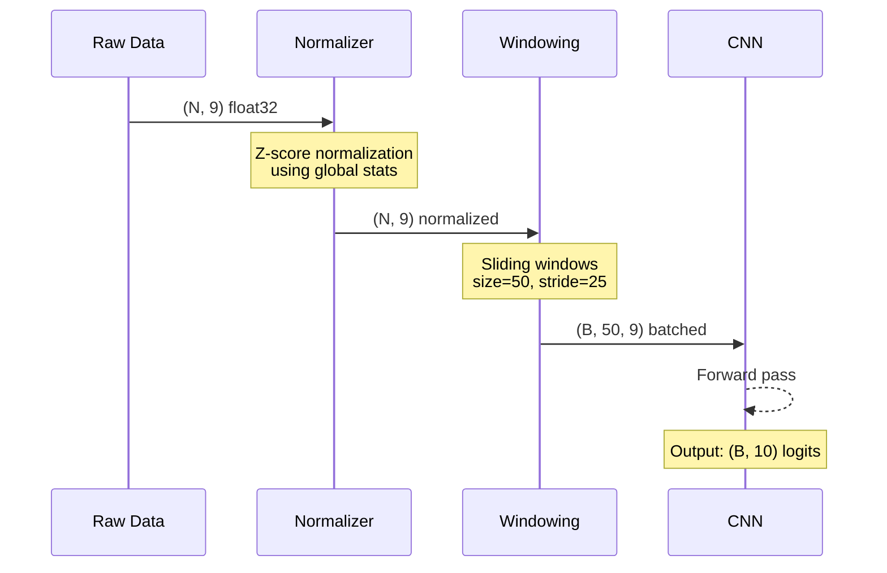
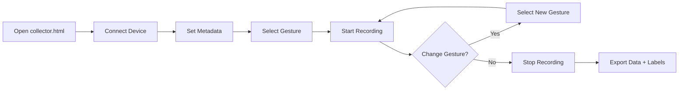

# SIMCAP ML Pipeline

Machine learning pipeline for gesture classification from 9-DoF IMU sensor data.

## Overview



## Quick Start

### 1. Install Dependencies

```bash
cd ml
pip install -r requirements.txt
```

### 2. Collect Labeled Data

Use the web-based collector UI:
```bash
# Serve locally
python -m http.server 8000

# Open in browser
# http://localhost:8000/src/web/GAMBIT/collector.html
```

Or use the command-line labeling tool on existing data:
```bash
python -m ml.label data/GAMBIT/2024-01-05T16:41:20.581Z.json
```

### 3. Train Model

```bash
python -m ml.train --data-dir data/GAMBIT --epochs 50
```

### 4. Evaluate Results

Training outputs are saved to `ml/models/`:
- `gesture_model.keras` - Keras model
- `gesture_model.tflite` - TensorFlow Lite (for embedded)
- `training_results.json` - Metrics and history

## Components

### Schema (`schema.py`)

Defines the gesture vocabulary and data structures:

```python
from ml import Gesture, SessionMetadata, LabeledSegment

# Available gestures
print(Gesture.names())
# ['rest', 'fist', 'open_palm', 'index_up', 'peace',
#  'thumbs_up', 'ok_sign', 'pinch', 'grab', 'wave']

# Create labeled segment
segment = LabeledSegment(
    start_sample=0,
    end_sample=100,
    gesture=Gesture.FIST,
    confidence='high'
)
```

### Data Loader (`data_loader.py`)

Loads and preprocesses sensor data:

```python
from ml import GambitDataset

dataset = GambitDataset('data/GAMBIT')

# Get summary
print(dataset.summary())

# Load train/val split
X_train, y_train, X_val, y_val = dataset.get_train_val_split()
print(f"Train: {X_train.shape}, Val: {X_val.shape}")
```

### Model (`model.py`)

1D CNN for gesture classification:

```python
from ml.model import create_cnn_model_keras

model = create_cnn_model_keras(
    window_size=50,    # 1 second at 50Hz
    num_classes=10     # Gesture vocabulary size
)
model.summary()
```

### Labeling Tool (`label.py`)

Interactive CLI for annotating sessions:

```bash
python -m ml.label data/GAMBIT/2024-01-05T16:41:20.581Z.json

Commands:
  l 0 100 fist     # Label samples 0-100 as "fist"
  ls               # List labels
  p 0 50           # Print/visualize samples 0-50
  m split train    # Set metadata (train/validation/test)
  w                # Save labels
  q                # Quit
```

### Training Script (`train.py`)

End-to-end training pipeline:

```bash
python -m ml.train \
    --data-dir data/GAMBIT \
    --output-dir ml/models \
    --epochs 50 \
    --batch-size 32 \
    --window-size 50 \
    --stride 25
```

## Data Format

### Sensor Data (`*.json`)

Array of telemetry samples at 50Hz:

```json
[
  {
    "ax": 4901, "ay": -3048, "az": 5982,
    "gx": 2605, "gy": -10757, "gz": -18821,
    "mx": 471, "my": -207, "mz": -1547,
    "l": 0.089, "t": -75, "c": 3479,
    "s": 0, "b": 100, "n": 1
  },
  ...
]
```

### Metadata (`*.meta.json`)

Session metadata and labels:

```json
{
  "timestamp": "2024-01-05T16:41:20.581Z",
  "subject_id": "user_001",
  "environment": "home",
  "hand": "right",
  "split": "train",
  "labels": [
    {
      "start_sample": 0,
      "end_sample": 150,
      "gesture": "rest",
      "confidence": "high"
    },
    {
      "start_sample": 150,
      "end_sample": 300,
      "gesture": "fist",
      "confidence": "high"
    }
  ],
  "session_notes": "",
  "sample_rate_hz": 50
}
```

## Architecture

### CNN Model

```
Input: (batch, 50, 9)  # 50 timesteps × 9 IMU features
    ↓
Conv1D(32, 5) + BN + ReLU + MaxPool(2) + Dropout
    ↓
Conv1D(64, 5) + BN + ReLU + MaxPool(2) + Dropout
    ↓
Conv1D(64, 5) + BN + ReLU
    ↓
GlobalAveragePooling1D
    ↓
Dense(64) + ReLU + Dropout
    ↓
Dense(10) + Softmax  # 10 gesture classes
```

### Data Pipeline



## Workflow

### 1. Data Collection Workflow



### 2. Training Workflow

```bash
# 1. Check dataset status
python -m ml.label --info data/GAMBIT

# 2. Label unlabeled sessions
python -m ml.label data/GAMBIT/SESSION.json

# 3. Train model
python -m ml.train --data-dir data/GAMBIT

# 4. Review results
cat ml/models/training_results.json
```

## Best Practices

### Data Collection

1. **Consistent positioning** - Mount device in same orientation each session
2. **Clear gestures** - Hold each pose for at least 1-2 seconds
3. **Balanced classes** - Collect similar amounts of each gesture
4. **Split assignment** - Use 80/10/10 train/val/test split
5. **Multiple subjects** - Collect from different hands/users for generalization

### Labeling

1. **Clean boundaries** - Label only clear, stable gesture segments
2. **Exclude transitions** - Don't label movement between gestures
3. **Confidence levels** - Mark uncertain labels as "medium" or "low"
4. **Verify visually** - Use `p` command to verify label boundaries

### Training

1. **Start simple** - Use default hyperparameters first
2. **Monitor overfitting** - Watch train vs. validation loss
3. **Class imbalance** - Ensure reasonable gesture distribution
4. **Augmentation** - Consider time-warping, noise injection (future)

## Future Improvements

- [ ] Data augmentation (time warping, jittering)
- [ ] Hyperparameter tuning
- [ ] Cross-validation
- [ ] Real-time inference demo
- [ ] On-device deployment (ESP32/TFLite Micro)
- [ ] Tier 2: Dynamic gesture sequences (LSTM/GRU)
- [ ] Tier 3: Continuous hand pose regression

## Related

- [GAMBIT Device Firmware](../src/device/GAMBIT/)
- [GAMBIT Web UI](../src/web/GAMBIT/)
- [Design Documents](../docs/design/)
