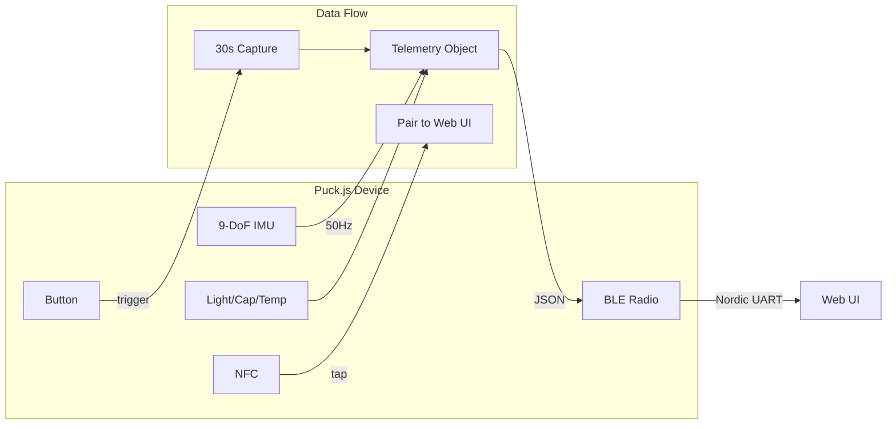
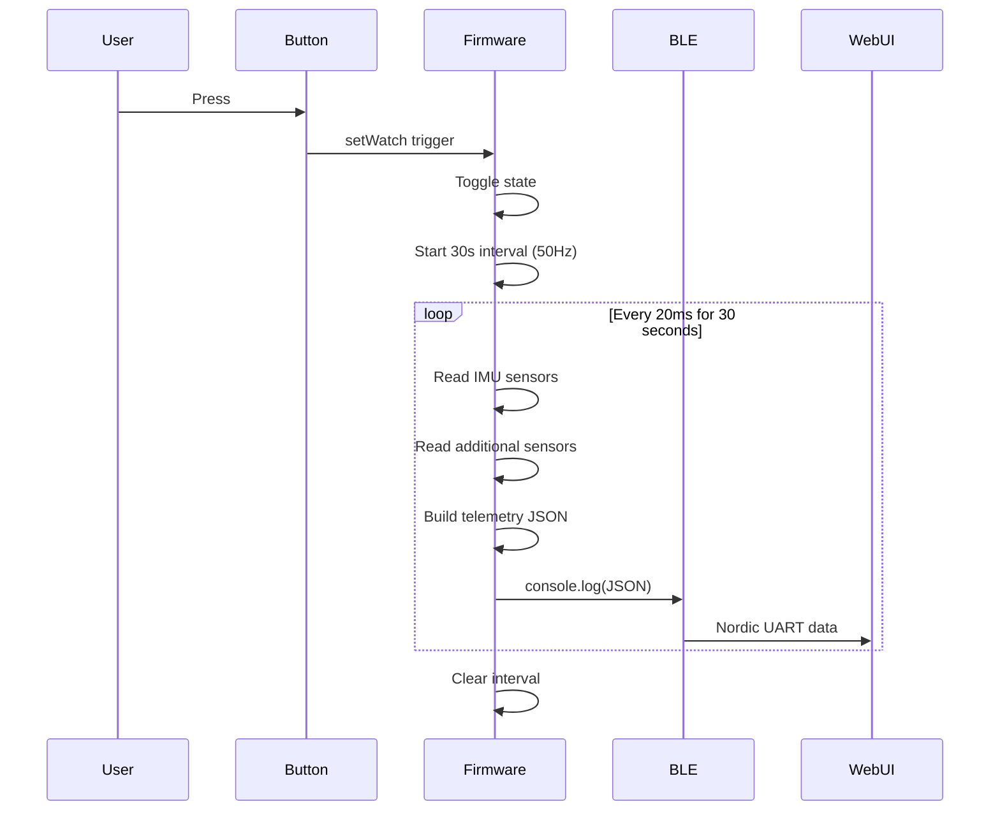
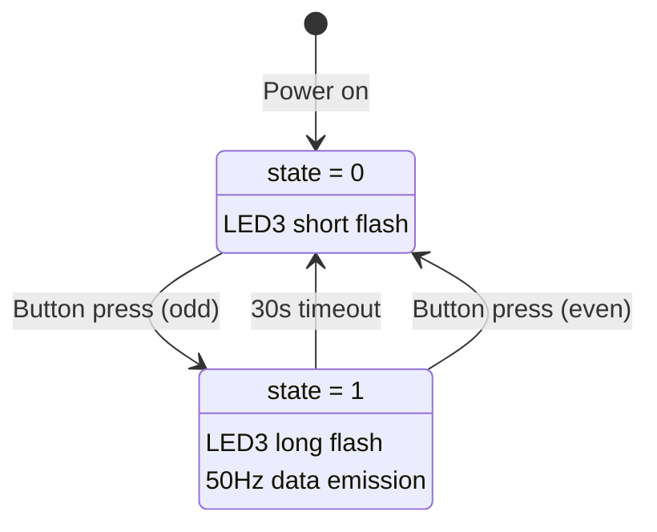

# GAMBIT Device Firmware

**Gyroscope Accelerometer Magnetometer Baseline Inference Telemetry**

Espruino Puck.js firmware for 9-DoF IMU data collection and BLE streaming.

## Overview

GAMBIT is the active device firmware that collects sensor data from the Puck.js hardware and streams it via BLE to the web UI for visualization and storage.



## Hardware Platform

**Device:** Espruino Puck.js v2
- nRF52840 processor
- 9-DoF IMU (LSM6DS3 + LIS2MDL)
- BLE 5.0
- NFC tag
- RGB LED
- Button
- Light sensor
- Capacitive touch

## Telemetry Data Structure

Each telemetry packet contains:

```javascript
{
  // Accelerometer (raw values, device coordinates)
  ax: number,  // X-axis acceleration
  ay: number,  // Y-axis acceleration
  az: number,  // Z-axis acceleration

  // Gyroscope (raw values, degrees/second)
  gx: number,  // X-axis angular velocity
  gy: number,  // Y-axis angular velocity
  gz: number,  // Z-axis angular velocity

  // Magnetometer (raw values, microtesla)
  mx: number,  // X-axis magnetic field
  my: number,  // Y-axis magnetic field
  mz: number,  // Z-axis magnetic field

  // Additional sensors
  l: number,   // Light sensor (0-1)
  t: number,   // Temperature (magnetometer temp)
  c: number,   // Capacitive sense value

  // State
  s: number,   // State (0=off, 1=on)
  n: number,   // Button press count
  b: number    // Battery percentage
}
```

## Architecture



## Key Features

### 1. Sensor Sampling (50 Hz)

The `emit()` function reads all sensors and constructs a telemetry object:

```javascript
function emit() {
    var mag = Puck.mag()    // Magnetometer
    var accel = Puck.accel() // Accelerometer + Gyroscope

    telemetry.ax = accel.acc.x
    // ... all sensor assignments

    console.log("\nGAMBIT" + JSON.stringify(telemetry))
    return telemetry;
}
```

### 2. Burst Capture Mode

Data collection runs for 30-second bursts to conserve battery:

```javascript
function getData() {
    if (interval) return emit();

    setTimeout(function(){
        clearInterval(interval)
        interval = null
    }, 30000)  // 30 second capture

    interval = setInterval(emit, 50)  // 50Hz = 20ms
    return(emit())
}
```

### 3. NFC Tap-to-Pair

Tapping a phone to the device triggers the WebBLE pairing flow:

```javascript
NRF.nfcURL("webble://christopherdebeer.github.io/simcap/src/web/GAMBIT/");
```

### 4. LED Feedback

| LED | Color | Meaning |
|-----|-------|---------|
| LED1 | Red | (unused in current impl) |
| LED2 | Green | NFC field detected |
| LED3 | Blue | Button press / state toggle |

### 5. Button State Machine



## Communication Protocol

**Transport:** BLE Nordic UART Service (NUS)
- Service UUID: `6e400001-b5a3-f393-e0a9-e50e24dcca9e`
- TX Characteristic: `6e400002-b5a3-f393-e0a9-e50e24dcca9e`
- RX Characteristic: `6e400003-b5a3-f393-e0a9-e50e24dcca9e`

**Data Format:** Newline-delimited JSON with `GAMBIT` prefix
```
\nGAMBIT{"ax":-464,"ay":-7949,"az":-2282,...}
```

## Installation

1. Connect to your Puck.js via the [Espruino Web IDE](https://www.espruino.com/Web+IDE)
2. Copy the contents of `app.js`
3. Paste into the IDE editor
4. Click "Send to Espruino"
5. For persistent storage, save to flash

## Usage

1. **NFC Tap:** Tap phone to Puck.js to open web UI
2. **Manual Connect:** Press button, then connect via web UI
3. **Get Data:** Press "Get data" button in web UI or press device button

## Disabled Features

The following features are implemented but commented out:

- **Movement Sensor:** Accelerometer-based idle detection with MQTT advertising
- **Magnetic Field Sensor:** Discrete magnetic field change detection
- **MQTT Advertising:** BLE advertising packets for EspruinoHub integration

These can be re-enabled by uncommenting the relevant code blocks.

## Data Files

Baseline data collected with this firmware is stored in:
```
data/GAMBIT/*.json
```

See the [Web UI README](../../web/GAMBIT/about) for data collection workflow.

## Related Components

- **Web UI:** [src/web/GAMBIT/](../../web/GAMBIT/) - Data visualization and collection interface
- **BAE Reference:** [src/device/BAE/](../BAE/) - BLE advertising reference implementation
- **Design Docs:** [docs/design/](../../../docs/design/) - Future vision and ML pipeline proposals

---

[← Back to SIMCAP](../../../)
