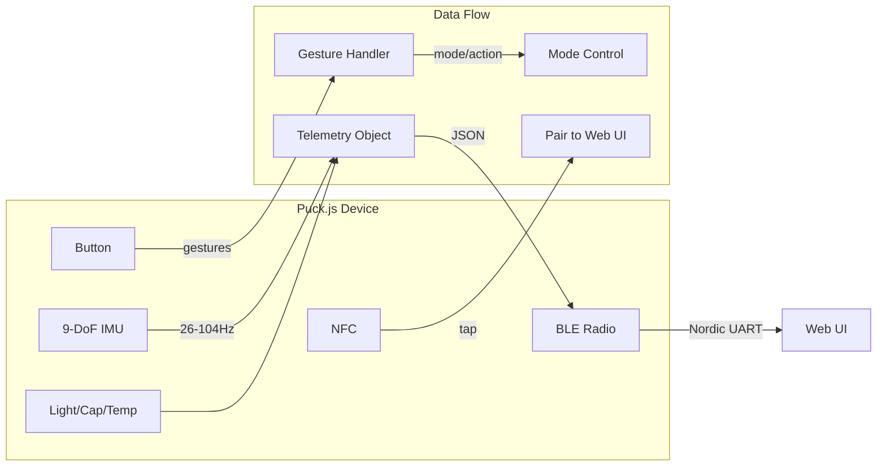

# GAMBIT Device Firmware

**Gyroscope Accelerometer Magnetometer Baseline Inference Telemetry**

Espruino Puck.js firmware for 9-DoF IMU data collection and BLE streaming.

## Overview

GAMBIT is the active device firmware that collects sensor data from the Puck.js hardware and streams it via BLE to the web UI for visualization and storage.



## Hardware Platform

**Device:** Espruino Puck.js v2
- nRF52840 processor
- 9-DoF IMU (LSM6DS3 + MMC5603NJ)
- BLE 5.0
- NFC tag
- RGB LED (3 LEDs)
- Button
- Light sensor
- Capacitive touch

## Version History

| Version | Features |
|---------|----------|
| v0.3.x | Basic streaming, logging, framing protocol |
| v0.4.0 | **Button gestures, sampling modes, context awareness, LED patterns** |

## Telemetry Data Structure

Each telemetry packet contains:

```javascript
{
  // Accelerometer (raw LSB values)
  ax: number,  // X-axis acceleration
  ay: number,  // Y-axis acceleration
  az: number,  // Z-axis acceleration

  // Gyroscope (raw LSB values)
  gx: number,  // X-axis angular velocity
  gy: number,  // Y-axis angular velocity
  gz: number,  // Z-axis angular velocity

  // Magnetometer (raw LSB values)
  mx: number,  // X-axis magnetic field
  my: number,  // Y-axis magnetic field
  mz: number,  // Z-axis magnetic field

  // Environmental sensors
  l: number,   // Light sensor (0-1)
  t: number,   // Temperature (magnetometer temp)
  c: number,   // Capacitive sense value

  // State
  s: number,   // State (0=off, 1=on)
  n: number,   // Button press count
  b: number,   // Battery percentage

  // New in v0.4.0
  mode: string, // Sampling mode: L/N/H/B
  ctx: string,  // Context: u/s/h/a/t
  grip: number  // Grip detected: 0/1
}
```

## Button Gestures (v0.4.0+)

The button now supports multi-tap gestures:

| Gesture | Detection | LED Feedback | Action |
|---------|-----------|--------------|--------|
| Single Tap | 1 tap, <300ms | Blue pulse | Toggle streaming |
| Double Tap | 2 taps, <300ms each | Blue double pulse | Cycle sampling mode |
| Triple Tap | 3+ taps, <300ms each | Green pulse | Mark event/annotation |
| Long Press | Hold 1-3s | Green fade | Show battery / Calibrate context |
| Very Long Press | Hold >3s | Red fade | Enter low power mode |

## Sampling Modes (v0.4.0+)

Four sampling modes optimize for different use cases:

| Mode | Accel/Gyro | Magnetometer | Light/Cap | Battery | Use Case |
|------|------------|--------------|-----------|---------|----------|
| LOW_POWER | 26Hz | 5Hz | 1.3Hz | 0.13Hz | Background monitoring |
| NORMAL | 26Hz | 13Hz | 2.6Hz | 0.26Hz | Standard tracking |
| HIGH_RES | 52Hz | 52Hz | 10Hz | 0.52Hz | Detailed gesture capture |
| BURST | 104Hz | 104Hz | 10Hz | 0.52Hz | Maximum resolution |

**Mode Control:**
- Double-tap button to cycle modes
- Call `setMode("MODE_NAME")` via BLE
- LED indicates current mode on change

## Context Awareness (v0.4.0+)

The firmware detects device context using light and capacitive sensors:

| Context | Detection | Auto-Action |
|---------|-----------|-------------|
| `stored` | Dark + no grip | Switch to LOW_POWER |
| `held` | Grip detected | Maintain current mode |
| `active` | Grip + motion | Switch to NORMAL if LOW_POWER |
| `table` | Light + no grip | Maintain current mode |
| `unknown` | Undetermined | No action |

**Calibration:** Long-press button (when not calibrated) to establish baseline readings.

**Hardware Note:** The capacitive sensor requires physical wiring to D11. See the [Capacitive Wiring Guide](../../../docs/GAMBIT-capacitive-wiring.md) for electrode design and installation.

## LED Feedback System (v0.4.0+)

| LED | Color | Usage |
|-----|-------|-------|
| LED1 | Red | Low battery, errors, very long press |
| LED2 | Green | NFC, success, calibration, triple tap |
| LED3 | Blue | Button press, streaming, mode indicator |

**Mode Indicators:**
- LOW_POWER: Quick green flash
- NORMAL: Blue pulse
- HIGH_RES: Double blue flash
- BURST: Purple (red + blue)

**Battery Indicators:**
- >60%: Triple green flash
- 30-60%: Yellow flashes (red + green)
- 10-30%: Red flashes
- <10%: Fast red flashes

## Frame Protocol

**Transport:** BLE Nordic UART Service (NUS)
- Service UUID: `6e400001-b5a3-f393-e0a9-e50e24dcca9e`
- TX Characteristic: `6e400002-b5a3-f393-e0a9-e50e24dcca9e`
- RX Characteristic: `6e400003-b5a3-f393-e0a9-e50e24dcca9e`

**Frame Format:** `\x02TYPE:LENGTH\nPAYLOAD\x03`

```
\x02 = STX (Start of Text) - Frame start marker
TYPE = Message type identifier
LENGTH = Payload length in bytes (decimal)
\n = Header/payload separator
PAYLOAD = JSON data
\x03 = ETX (End of Text) - Frame end marker
```

### Frame Types

| Type | Description | Direction | Trigger |
|------|-------------|-----------|---------|
| `T` | Telemetry sample | Device→Host | Streaming interval |
| `FW` | Firmware info | Device→Host | `getFirmware()` |
| `LOGS` | Device log entries | Device→Host | `getLogs()` |
| `LOG_STATS` | Log statistics | Device→Host | `getLogStats()` |
| `LOGS_CLEARED` | Clear confirmation | Device→Host | `clearLogs()` |
| `BTN` | Button gesture | Device→Host | Button interaction |
| `MODE` | Mode change | Device→Host | Mode change |
| `CTX` | Context change | Device→Host | Context detection |
| `STREAM_START` | Stream started | Device→Host | `getData()` |
| `STREAM_STOP` | Stream stopped | Device→Host | `stopData()` |
| `MARK` | Event marker | Device→Host | Triple tap |
| `CAL` | Calibration | Device→Host | `calibrateContext()` |
| `SLEEP` | Sleep mode | Device→Host | Very long press |
| `CONN` | Connection event | Device→Host | BLE connect |

## API Reference

### Streaming Control

```javascript
// Start streaming (30s timeout, mode-based rate)
getData()

// Start streaming with specific count
getData(500)  // 500 samples

// Start streaming with count and custom rate
getData(500, 20)  // 500 samples at 50Hz (20ms interval)

// Stop streaming
stopData()
```

### Mode Control (v0.4.0+)

```javascript
// Set specific mode
setMode("LOW_POWER")
setMode("NORMAL")
setMode("HIGH_RES")
setMode("BURST")

// Get current mode
getMode()  // Returns {mode: "NORMAL", config: {...}}

// Cycle to next mode
cycleMode()
```

### Context & Calibration (v0.4.0+)

```javascript
// Calibrate light/capacitive baseline
calibrateContext()

// Show battery via LEDs
showBatteryLevel()
```

### Device Info

```javascript
// Get firmware info
getFirmware()

// Get device logs
getLogs()
getLogs(10)  // Since index 10

// Clear logs
clearLogs()

// Get log stats
getLogStats()
```

## On-Device Logging

GAMBIT includes a rolling-window logging system:

```javascript
// Log levels: E=Error, W=Warn, I=Info, D=Debug
logError('Sensor read failed');
logWarn('Low battery: 15%');
logInfo('Stream started');
logDebug('Memory: 1234/2048');
```

**What's Logged:**
- Boot events (firmware version, battery level, memory)
- BLE connections/disconnections
- Button gestures and actions
- Stream start/stop with sample counts
- Mode changes and context transitions
- NFC field detection
- Calibration events
- Errors and warnings

**Storage:** Rolling window of 50 entries (~2-3KB RAM)

## Installation

1. Connect to your Puck.js via the [Espruino Web IDE](https://www.espruino.com/Web+IDE)
2. Copy the contents of `app.js`
3. Paste into the IDE editor
4. Click "Send to Espruino"
5. For persistent storage, save to flash with `save()`

## Usage

1. **NFC Tap:** Tap phone to Puck.js to open web UI
2. **Manual Connect:** Press button, then connect via web UI
3. **Get Data:** Press "Get data" button in web UI or tap device button

### Quick Start with Gestures

1. **Single tap** - Start/stop data streaming
2. **Double tap** - Cycle through sampling modes
3. **Triple tap** - Mark an event in the data stream
4. **Long press** - Calibrate sensors (first time) or show battery level
5. **Very long press** - Enter low power mode

## Data Files

Baseline data collected with this firmware is stored in:
```
data/GAMBIT/*.json
```

See the [Web UI README](../../web/GAMBIT/about) for data collection workflow.

## Related Components

- **Web UI:** [apps/gambit/](../../../apps/gambit/) - Data visualization and collection interface
- **Client Library:** [apps/gambit/gambit-client.ts](../../../apps/gambit/gambit-client.ts) - TypeScript client
- **Core Types:** [packages/core/src/types/](../../../packages/core/src/types/) - Telemetry type definitions
- **Design Docs:** [docs/](../../../docs/) - Technical documentation

---

[← Back to SIMCAP](../../../)
