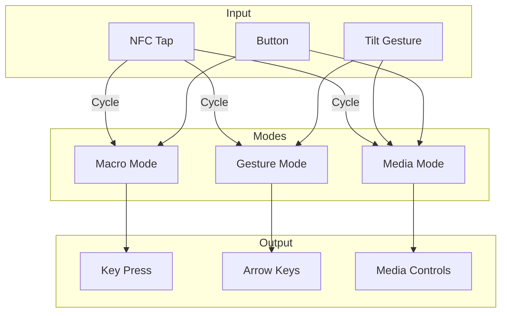
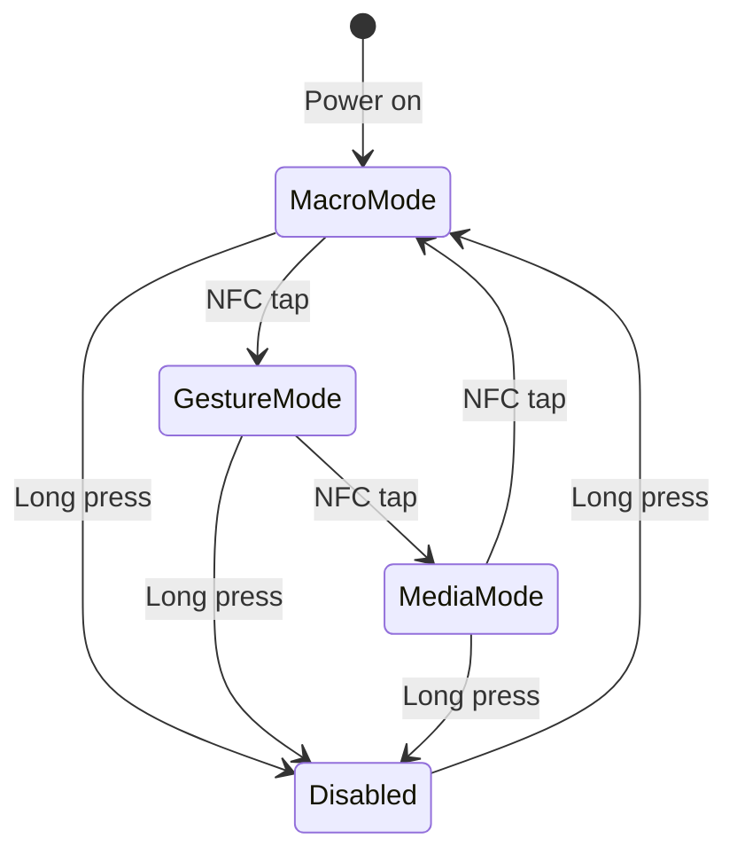

# SIMCAP KEYBOARD

**BLE HID Keyboard Firmware for Puck.js**

Converts Puck.js button presses and gestures into Bluetooth keyboard/media key events. Pairs as a standard HID keyboard with any Bluetooth-enabled device.

## Features

- **Macro Mode** - Button triggers configurable key combinations
- **Gesture Mode** - Tilt directions map to arrow keys
- **Media Mode** - Control playback with gestures and button



## Modes

### Macro Mode (Default)
- Button press executes configured macro/key
- Red LED flash on activation

| Config | Example | Description |
|--------|---------|-------------|
| `CONFIG.macroKey = "copy"` | Ctrl+C | Use preset macro |
| `CONFIG.macroKey = "a"` | 'a' | Single key |
| `CONFIG.macroModifier = MODIFIERS.CTRL` | Ctrl+key | Add modifier |

**Preset Macros:**
- `copy`, `paste`, `cut`, `undo`, `redo`
- `save`, `selectAll`, `find`
- `newTab`, `closeTab`, `switchTab`
- `enter`, `escape`, `space`

### Gesture Mode
- Tilt device to send arrow keys
- Green LED flash on activation

| Tilt | Key |
|------|-----|
| Up | Arrow Up |
| Down | Arrow Down |
| Left | Arrow Left |
| Right | Arrow Right |

### Media Mode
- Button press: Play/Pause
- Tilt up: Volume Up
- Tilt down: Volume Down
- Tilt left: Previous Track
- Tilt right: Next Track
- Blue LED flash on activation

## Controls

| Action | Input | Result |
|--------|-------|--------|
| Execute macro/key | Button press | Depends on mode |
| Cycle mode | NFC tap | Macro → Gesture → Media |
| Toggle on/off | Long press (1s) | Green (on) / Red (off) |

## Configuration

Via BLE console:

```javascript
// Set macro to Ctrl+S (save)
CONFIG.macroKey = "save";

// Or custom key combo
CONFIG.macroKey = "s";
CONFIG.macroModifier = MODIFIERS.CTRL;

// Change mode
CONFIG.mode = "gesture";  // or "macro" or "media"

// Adjust gesture sensitivity
CONFIG.gestureThreshold = 3000;
```

## Console Functions

```javascript
// Send specific key
sendKey(kb.KEY.ENTER, 0);

// Send key with modifier
sendKey(kb.KEY.C, MODIFIERS.CTRL);

// Execute preset macro
sendMacro("copy");

// Type a string
typeString("Hello World");

// Get status
getTelemetry();
```

## State Machine



## Pairing

1. Upload firmware to Puck.js
2. Open Bluetooth settings on your device
3. Look for "SIMCAP Keys"
4. Pair and connect
5. Press button to test

## Technical Details

- **Protocol:** BLE HID Keyboard
- **HID Appearance:** 0x03C1 (Keyboard)
- **Gesture rate:** 20 Hz
- **Repeat delay:** 200ms (configurable)

## Installation

Use the [Firmware Loader](../../web/loader/) or Espruino Web IDE:

1. Connect to Puck.js
2. Copy contents of `app.js`
3. Paste and send to device
4. Save to flash: `save()`

## Related

- [Firmware Loader](../../web/loader/)
- [MOUSE Firmware](../MOUSE/) - BLE HID Mouse
- [GAMBIT Firmware](../GAMBIT/) - Data collection
- [Espruino BLE HID Docs](https://www.espruino.com/BLE+Keyboard)

---

[← Back to SIMCAP](../../../)

---

<link rel="stylesheet" href="../../simcap.css">
