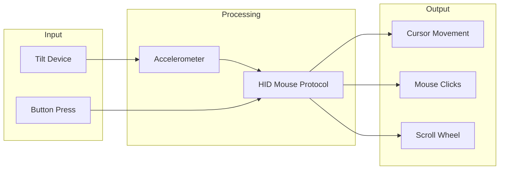
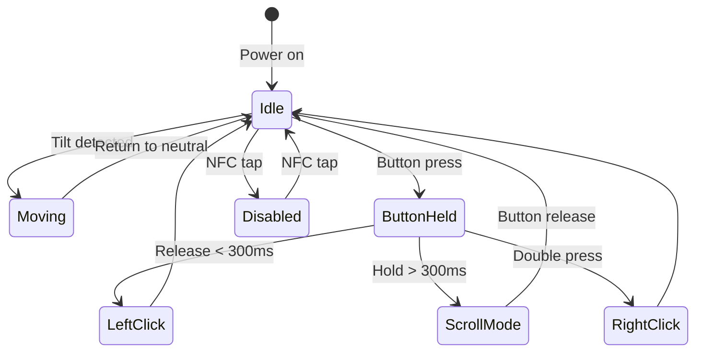

# SIMCAP MOUSE

**BLE HID Mouse Firmware for Puck.js**

Converts Puck.js accelerometer data into Bluetooth mouse movements. Pairs as a standard HID mouse with any Bluetooth-enabled device.

## Features



## Controls

| Action | Input | LED Feedback |
|--------|-------|--------------|
| Move cursor | Tilt device | - |
| Left click | Single button press | Red flash |
| Right click | Double button press | Blue flash |
| Scroll mode | Hold button + tilt | Blue flash (on enter) |
| Toggle on/off | NFC tap | Green (on) / Red (off) |

## Configuration

Adjustable via BLE console:

```javascript
CONFIG.sensitivity = 5;      // 1-10, higher = faster
CONFIG.deadzone = 500;       // Ignore small movements
CONFIG.invertX = false;      // Invert X axis
CONFIG.invertY = false;      // Invert Y axis
CONFIG.scrollSensitivity = 2;
```

## Pairing

1. Upload firmware to Puck.js
2. On your device, open Bluetooth settings
3. Look for "SIMCAP Mouse"
4. Pair and connect
5. Tilt Puck.js to move cursor

### Windows 11 Notes

The firmware includes HID appearance advertising for Windows 11 compatibility. If pairing fails:
1. Remove device from Bluetooth settings
2. Reset Puck.js (remove/reinsert battery)
3. Re-pair

## State Machine



## Technical Details

- **Update rate:** 50 Hz
- **Protocol:** BLE HID (Human Interface Device)
- **HID Appearance:** 0x03C2 (Mouse)
- **Movement range:** -127 to +127 per axis
- **Scroll:** Vertical only

## Installation

Use the [Firmware Loader](../../web/loader/) or Espruino Web IDE:

1. Connect to Puck.js
2. Copy contents of `app.js`
3. Paste and send to device
4. Save to flash: `save()`

## Related

- [Firmware Loader](../../web/loader/)
- [GAMBIT Firmware](../GAMBIT/) - Data collection
- [Espruino BLE HID Docs](https://www.espruino.com/BLE+Keyboard)

---

[← Back to SIMCAP](../../../)

---

<link rel="stylesheet" href="../../simcap.css">
