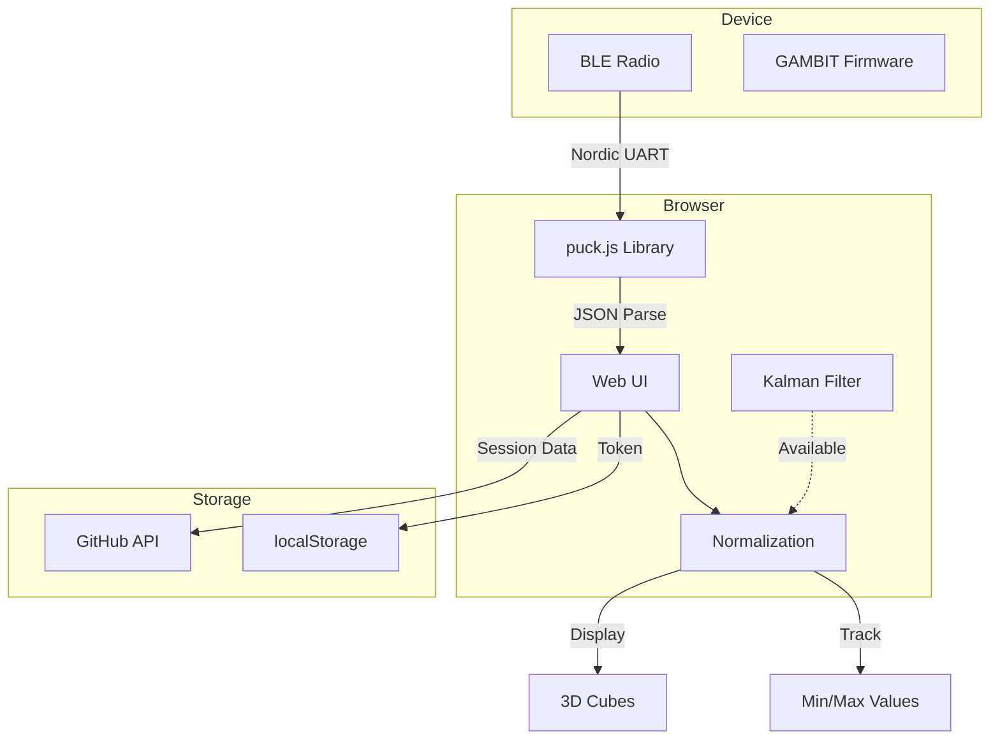
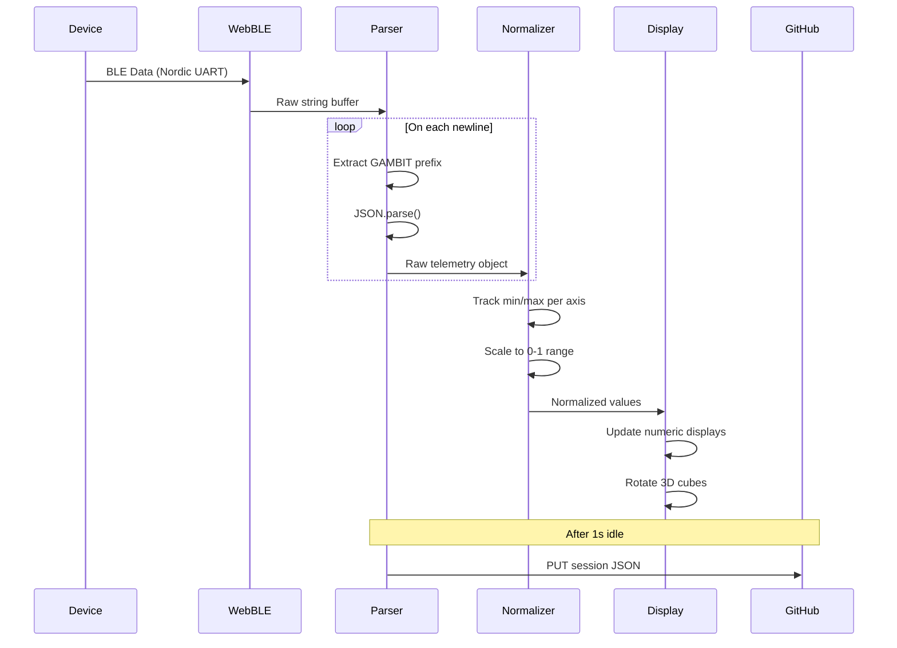
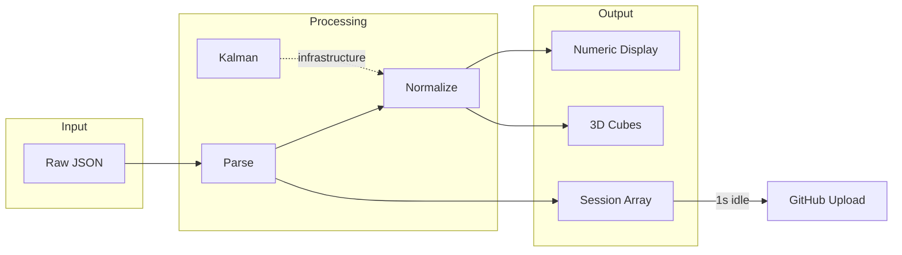

# GAMBIT Web UI

**Gyroscope Accelerometer Magnetometer Baseline Inference Telemetry**

Web-based interface for real-time sensor visualization and data collection from GAMBIT firmware devices.

## Overview

A mobile-optimized Progressive Web App (PWA) that connects to Puck.js devices via WebBLE, displays real-time sensor data, and optionally uploads captured sessions to GitHub.



## Features

### Implemented

- **WebBLE Connection** - Connect to Puck.js devices via Web Bluetooth API
- **Real-time Visualization** - Live display of 9-DoF sensor values
- **3D Orientation Cubes** - CSS 3D cubes showing acc/gyro/mag orientation
- **Runtime Normalization** - Min/max tracking for dynamic range display
- **GitHub Data Upload** - Automatic session upload to repository
- **NFC Launch** - Open directly via NFC tap on device
- **PWA Support** - Installable web app with mobile optimization
- **Kalman Filter** - Library included (infrastructure ready)

### Data Pipeline



## Architecture

### Files

| File | Purpose | Lines |
|------|---------|-------|
| `index.html` | Main UI with embedded JavaScript | ~508 |
| `puck.js` | WebBLE communication library | ~479 |
| `kalman.js` | Kalman filter implementation | ~80 |

### Communication Layer (puck.js)

The `puck.js` library provides the WebBLE interface:

```javascript
// Device discovery with multiple name prefixes
navigator.bluetooth.requestDevice({
    filters: [
        { namePrefix: 'Puck.js' },
        { namePrefix: 'Pixl.js' },
        { namePrefix: 'MDBT42Q' },
        // ... other Espruino devices
    ],
    optionalServices: [NORDIC_SERVICE]
})

// Key functions
Puck.write(data, callback)  // Send command to device
Puck.eval(expr, callback)   // Execute JS and return result
Puck.connect(callback)      // Establish connection
Puck.isConnected()          // Check connection status
```

### Data Flow



### Normalization

Values are normalized to 0-1 range using runtime min/max tracking:

```javascript
function updateMinMaxsReturnNorm(key, val) {
    if (typeof minMaxs[key] === 'undefined') {
        minMaxs[key] = {
            min: val,
            max: val,
            kalman: new KalmanFilter({R: 0.01, Q: 3}),
            values: [],
            kalmanValues: []
        }
    }
    // Update min/max bounds
    if (minMaxs[key].min > val) minMaxs[key].min = val
    if (minMaxs[key].max < val) minMaxs[key].max = val

    // Return normalized value (0-1)
    return (val - minMaxs[key].min) / (minMaxs[key].max - minMaxs[key].min)
}
```

### 3D Visualization

CSS 3D transforms driven by normalized sensor values:

```javascript
// Map 0-1 normalized value to 0-360 degree rotation
window.cubeA.style = `transform: rotateX(${360 * t.ax}deg) rotateY(${360 * t.ay}deg) rotateZ(${360 * t.az}deg);`
window.cubeG.style = `transform: rotateX(${360 * t.gx}deg) rotateY(${360 * t.gy}deg) rotateZ(${360 * t.gz}deg);`
window.cubeM.style = `transform: rotateX(${360 * t.mx}deg) rotateY(${360 * t.my}deg) rotateZ(${360 * t.mz}deg);`
```

## Getting Started

### Prerequisites

- SIMCAP PALM device (or compatible Espruino Puck.js) running [GAMBIT firmware](../../device/GAMBIT/)
- Modern browser with WebBLE support (Chrome, Edge, or WebBLE app on iOS)

### Quick Start

1. **NFC Tap:** Tap your phone to the Puck.js device
2. **Follow Notification:** Open the advertised URL
3. **Connect:** Press "Connect" and select your device
4. **Capture:** Press "Get data" or the device button

### Manual Setup

1. Open [hosted Web UI](https://christopherdebeer.github.io/simcap/src/web/GAMBIT/)
2. Click "Connect"
3. Select your Puck.js device from the browser picker
4. Click "Get data" to start capture

### iOS Users

WebBLE is not natively supported on iOS Safari. Install the [WebBLE app](https://itunes.apple.com/us/app/webble/id1193531073) from the App Store.

## Data Storage

### Session Upload

When a GitHub token is provided, sessions are automatically uploaded:

```javascript
// Endpoint: PUT /repos/{owner}/{repo}/contents/data/GAMBIT/{timestamp}.json
const filename = `${new Date().toISOString()}.json`
const endpoint = `https://api.github.com/repos/christopherdebeer/simcap/contents/data/GAMBIT/${filename}`
```

### Token Configuration

1. Enter your GitHub personal access token in the password field
2. Token is stored in `localStorage` for persistence
3. Requires `repo` scope for write access

### Data Location

Captured baseline data is stored at:
```
data/GAMBIT/{ISO-timestamp}.json
```

## UI Components

```
┌─────────────────────────────────────┐
│           - SIMCAP -                │
│            GAMBIT                   │
│                                     │
│   [Connect]        [Get data]       │
│                                     │
│   [GitHub token ••••••••••]         │
│                                     │
│   ████████████████████░░░░ Battery  │
│   Btn: 0    Count: 0    State: 0    │
│                                     │
│   Mag:  0.xxxx  0.xxxx  0.xxxx      │
│   Acc:  0.xxxx  0.xxxx  0.xxxx      │
│   Gyro: 0.xxxx  0.xxxx  0.xxxx      │
│                                     │
│   ┌───┐    ┌───┐    ┌───┐           │
│   │mag│    │acc│    │gyr│           │
│   └───┘    └───┘    └───┘           │
│   (3D rotating cubes)               │
└─────────────────────────────────────┘
```

## Todo

- [ ] Normalize baseline data before display/processing (currently uses runtime min/max)
- [ ] Add explicit "session" capture with start/stop controls
- [ ] Enable data export (download JSON locally)
- [ ] Integrate Kalman filter into display pipeline
- [ ] Add coordinate frame transformation options

## Related Components

- **Device Firmware:** [src/device/GAMBIT/](../../device/GAMBIT/) - Puck.js firmware
- **Data Collector:** [collector.html](./collector.html) - Labeled data collection for ML training
- **Sensor Synthesizer:** [synth.html](./synth.html) - Real-time sensor-reactive audio synthesis ([README](./SYNTH_README.md))
- **Baseline Data:** [data/GAMBIT/](../../../data/GAMBIT/) - Collected sensor data
- **Design Docs:** [docs/design/](../../../docs/design/) - Future vision and ML pipeline proposals

---

[← Back to SIMCAP](../../../)
